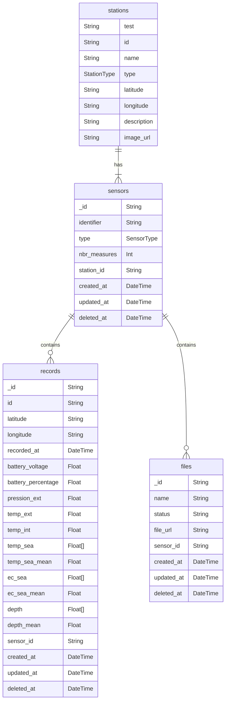

# Architecture

## Database

This database schema is deliberately simplified. It does not include user management concepts.

```mermaid

erDiagram
    stations {
        String test
        String id
        String name
        StationType type
        String latitude
        String longitude
        String description
        String image_url
    }

    sensors {
        _id String
        identifier String
        type SensorType
        nbr_measures   Int
        station_id String
        created_at      DateTime
        updated_at      DateTime
        deleted_at      DateTime

    }

    records {
        _id String
        id                  String
        latitude            String
        longitude           String
        recorded_at         DateTime
        battery_voltage     Float
        battery_percentage  Float
        pression_ext        Float
        temp_ext            Float
        temp_int            Float
        temp_sea            Float[]
        temp_sea_mean       Float
        ec_sea              Float[]
        ec_sea_mean         Float
        depth               Float[]
        depth_mean          Float
        sensor_id           String
        created_at          DateTime
        updated_at          DateTime
        deleted_at          DateTime
         }

    files {
        _id String
        name            String
        status          String
        file_url        String
        sensor_id       String
        created_at      DateTime
        updated_at      DateTime
        deleted_at      DateTime
    }

    stations ||--|{ sensors : has
    sensors ||--o{ records : contains
    sensors ||--o{ files : contains
```
